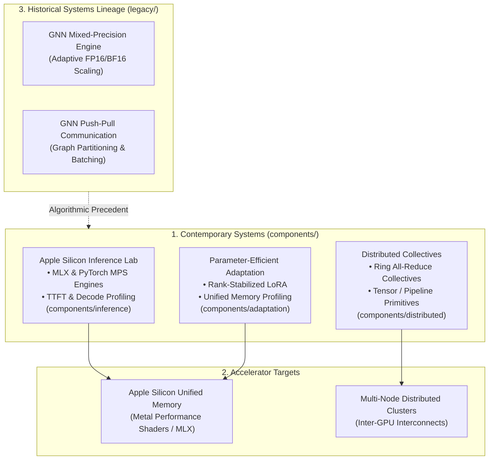

# Training & Inference Systems: ML Execution Infrastructure

[](LICENSE)
[](scripts/verify_all.sh)
[](#systems-architecture)
[](#1-apple-silicon-inference-lab-componentsinference)
[](scripts/verify_all.sh)
[](https://x.com/SupratikSarkar_)

> **High-efficiency machine learning systems engineering spanning Apple Silicon native inference, parameter-efficient LoRA adaptation, distributed training collectives, and historical graph neural network acceleration.**

---

## Overview

Achieving cost-effective, high-throughput machine learning requires deeply understanding hardware execution characteristics—from unified memory bandwidth on Apple Silicon to inter-node communication latency in distributed clusters.

**`training-inference-systems`** unifies contemporary edge and distributed execution runtimes with foundational graph neural network systems engineering:
1. **Apple Silicon Inference**: Sub-millisecond TTFT, high-throughput decoding, and unified memory profiling across MLX and PyTorch MPS backends.
2. **Local Parameter-Efficient Adaptation**: Low-Rank Adaptation (LoRA) and gradient checkpointing designed specifically for unified memory architectures.
3. **Distributed Training Primitives**: Clean, verified implementations of Ring All-Reduce collectives, tensor parallelism, and pipeline communication schedules.
4. **Historical Acceleration Lineage**: Foundational 2025 research in adaptive mixed-precision and communication reduction for large-scale graph neural networks.

```
+-------------------------------------------------------------------------------------------------+
|                                 TRAINING & INFERENCE SYSTEMS                                    |
|                                                                                                 |
|   +---------------------------+   +---------------------------+   +---------------------------+ |
|   |   components/inference    |   |   components/adaptation   |   |   components/distributed  | |
|   |  Apple Silicon MLX / MPS  |   |  PEFT / LoRA Fine-Tuning  |   |  Ring All-Reduce Prims    | |
|   |  TTFT, Throughput Profiler|   |  Gradient Checkpointing   |   |  Tensor/Pipeline Parallel | |
|   +---------------------------+   +---------------------------+   +---------------------------+ |
|                 |                               |                               |               |
|                 +-------------------------------+-------------------------------+               |
|                                                 |                                               |
|                                                 v (Architectural Evolution)                     |
|   +-----------------------------------------------------------------------------------------+   |
|   |                             legacy/ (Historical Foundations)                            |   |
|   |    GNN Mixed-Precision Acceleration | GNN Push-Pull Distributed Graph Communication     |   |
|   +-----------------------------------------------------------------------------------------+   |
+-------------------------------------------------------------------------------------------------+
```



---

## Systems Architecture

### 1. Apple Silicon Inference Lab (`components/inference/`)
* **Directory**: [`components/inference`](components/inference/)
* **Implemented Capabilities**:
  - Empirical runtime benchmark comparing Apple MLX against PyTorch MPS for autoregressive generation (`Llama-3.2-1B-Instruct`).
  - Time-To-First-Token (TTFT) and decode throughput (tokens/sec) measurement harnesses.
  - Resident memory tracking, unified memory bandwidth utilization, and thermal profiling.

### 2. Parameter-Efficient Adaptation Lab (`components/adaptation/`)
* **Directory**: [`components/adaptation`](components/adaptation/)
* **Implemented Capabilities**:
  - Rank-stabilized Low-Rank Adaptation (LoRA) for transformer attention projections.
  - Memory-efficient backpropagation utilizing PyTorch activation checkpointing.
  - Peak unified memory tracking under constrained edge-device budgets.

### 3. Distributed Training Primitives (`components/distributed/`)
* **Directory**: [`components/distributed`](components/distributed/)
* **Implemented Capabilities**:
  - Pure Python/PyTorch implementations of the **Ring All-Reduce** collective communication algorithm.
  - 1D Tensor Parallelism splitting weight matrices across distributed ranks.
  - Pipelined communication schedules demonstrating 1F1B (One-Forward-One-Backward) execution.
  - Deterministic gradient verification ensuring mathematical equivalence to monolithic execution.

### 4. Historical Systems Foundations (`legacy/`)
* **Directory**: [`legacy`](legacy/)
* **Historical Modules**:
  - `legacy/gnn-mixed-precision`: Dynamic numerical precision scaling for large-scale Graph Convolutional Networks (GCNs).
  - `legacy/gnn-push-pull`: Push-pull message batching reducing boundary node synchronization overhead in distributed graph neural networks.

---

## Capability Matrix

| System Component | Target Accelerator | Primary Metric / Capability | Verification Status |
| :--- | :--- | :--- | :---: |
| **Inference Lab** | Apple Silicon (MLX / MPS) | TTFT, Tokens/Sec, Peak RAM | **36 Passing Tests** |
| **Adaptation Lab** | Apple Silicon (PyTorch MPS) | LoRA Fine-Tuning, Memory Scaling | **41 Passing Tests** |
| **Distributed Primitives** | Multi-Process / Multi-Rank | Ring All-Reduce, Tensor Parallel | **42 Passing Tests** |
| **GNN Mixed-Precision** | Historical GPU / CPU | Dynamic Loss Scaling | Verified Baseline |
| **GNN Push-Pull** | Historical Distributed | Graph Partition Communication | Verified Baseline |

---

## Quick Start & Verification

### 1. Umbrella Verification Suite
Run the root verification harness to test all three contemporary components across isolated environments:

```bash
# Clone the repository
git clone https://github.com/supratik-sarkar/training-inference-systems.git
cd training-inference-systems

# Execute root verification suite (requires Python 3.12.13)
bash scripts/verify_all.sh
```

### 2. Standalone Execution Examples
Each contemporary package can be inspected and run independently:

```bash
# Benchmark Apple Silicon inference
cd components/inference
pip install -e ".[dev]"
python -m inference.benchmarks

# Run distributed collective tests
cd ../distributed
pip install -e ".[dev]"
pytest tests/ -q
```

---

## Repository Structure

```text
training-inference-systems/
├── components/
│   ├── inference/            # Apple Silicon MLX/MPS benchmarking and runtime
│   ├── adaptation/           # Parameter-efficient LoRA fine-tuning and memory audit
│   └── distributed/          # Ring All-Reduce, tensor parallelism, and 1F1B primitives
├── legacy/
│   ├── gnn-mixed-precision/  # Historical mixed-precision execution for large GNNs
│   └── gnn-push-pull/        # Historical push-pull communication reduction in GNNs
├── scripts/
│   └── verify_all.sh         # Unified verification runner across active components
├── HISTORY.md                # Provenance records, component dates, and merge lineage
├── LICENSE                   # Apache License 2.0
└── LICENSES.md               # Upstream licensing documentation
```

---

## Portfolio Navigation

Part of the **Engineering & Systems Portfolio** by [Supratik Sarkar](https://github.com/supratik-sarkar):
* [training-inference-systems](https://github.com/supratik-sarkar/training-inference-systems) — Accelerated training primitives and hardware-conscious inference.
* [agentic-ai-systems](https://github.com/supratik-sarkar/agentic-ai-systems) — Resilient agent runtimes, checkpointing, and protocol gateways.
* [multimodal-context-systems](https://github.com/supratik-sarkar/multimodal-context-systems) — Context assembly, graph retrieval, and multimodal grounding.
* [applied-ml-systems](https://github.com/supratik-sarkar/applied-ml-systems) — Anomaly detection, optimization, and recommendation engines.
* [StART](https://github.com/supratik-sarkar/StART) — Evidence-native model development and institutional review platform.
