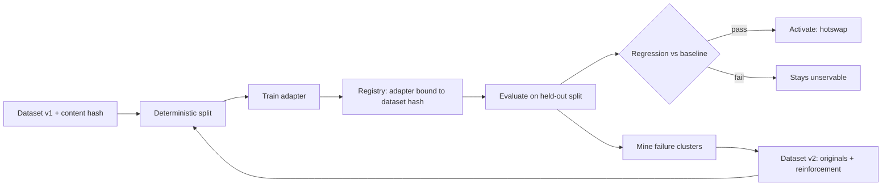

# apple-silicon-adapter-lab

The lifecycle around a fine-tuned adapter: versioned datasets, deterministic splits, a registry that knows what each adapter was trained on, evaluation with regression gates, and failure mining that produces the next dataset.

The training call itself is a small part of this. The parts that decide whether fine-tuning actually works are the ones around it — knowing exactly which data produced which adapter, being able to compare two adapters honestly, and turning what an adapter got wrong into the next iteration.

## The iteration loop



## LoRA and QLoRA are tracked separately

This is the distinction the repository is most careful about. `TrainingMethod` has both, and `MLXTrainingBackend.supports()` answers for each independently:

```python
backend.supports(TrainingMethod.LORA)
# (True, "mlx-lm exposes a documented LoRA training path")

backend.supports(TrainingMethod.QLORA)
# (False, "QLoRA support is UNVERIFIED. It depends on the installed mlx-lm
#          version and a quantised base model. This repository does not claim
#          it until scripts/train_mac.sh completes a QLoRA run.")
```

QLoRA needs a quantised base model *and* a runtime version that trains against it. Whether that works is a property of the installed mlx-lm and the chosen model, not of this code — so it is reported as unverified, and `_qlora_verified` is set only by a completed run. There are tests for both branches.

## No real training happened here

MLX requires Apple Silicon; this package was developed on x86 Linux. `MLXTrainingBackend` is written against `mlx_lm.lora` and **has never been executed**.

`FakeTrainingBackend` exists to exercise the orchestration — lifecycle transitions, registry bookkeeping, artifact paths — and it is unmistakable about what it is:

- `is_real_training` is `False`
- `final_loss` is `None`, never a plausible-looking number
- its artifact is literally named `<adapter_id>.NOT_A_REAL_ADAPTER.json`

`EvalReport.write(..., require_real=True)` raises `SyntheticEvaluationRefused` unless the run was real inference on Apple Silicon.

## An unevaluated adapter cannot serve traffic

```python
registry.activate("a1")
# AdapterNotServable: a1 has status registered; only an evaluated adapter may
# serve traffic. An unevaluated adapter is an unknown quantity, not a fast path.
```

The registry enforces the lifecycle rather than documenting it. Hotswap moves the previous adapter back to `evaluated` and records both transitions in its history.

## Regression comparison refuses mismatched datasets

```python
compare(baseline, candidate)
# passed=False, reasons=["evaluated against different datasets
#   (a3f9... vs 7c21...); the comparison is not meaningful"]
```

An improvement measured on different questions is not an improvement. This is refused by default rather than warned about.

## Failure mining

Failures are clustered by their **observable defect**, not by guesswork:

| Cluster | Meaning |
|---|---|
| `invalid_json` | Output did not parse. A formatting failure, not a knowledge failure |
| `wrong_field:<name>` | Parsed, but that field was incorrect |
| `text_mismatch` | Parsed and fields matched, but text differed |

`build_next_dataset()` then produces cycle 2 as the originals plus reinforcement examples — the *correct* completions for the prompts the adapter got wrong, tagged `reinforcement` with a pointer back to the example they reinforce. No new knowledge is invented; the model is shown the right answer to the questions it failed.

## Quickstart

```bash
python3 -m venv .venv && source .venv/bin/activate
pip install -e ".[dev]"
pytest
python examples/iteration_cycle.py
asal capabilities
```

CLI:

```bash
asal capabilities                     # what training is possible here
asal dataset --version v1 --out data/v1.json
asal registry --show
asal evaluate --adapter a1 --dataset data/v1.json
```

## The Mac gate

```bash
./scripts/train_mac.sh                      # LoRA
./scripts/train_mac.sh --method qlora       # attempts QLoRA, records the outcome
```

Refuses to run on non-arm64. Until it passes:

- `implementation_complete: true`
- `sandbox_unit_tests: true` (orchestration)
- `mlx_runtime: MAC_VALIDATION_REQUIRED`
- `training_benchmark: MAC_VALIDATION_REQUIRED`
- `qlora_support: UNVERIFIED`
- `publication_ready: false`

## Limitations

- No weights are trained here. The fake backend tests plumbing only.
- Exact-match and per-field JSON accuracy are the metrics. Adequate for structured extraction, wrong for open-ended generation.
- The seed dataset is eight examples. Enough to demonstrate the cycle, far too few to fine-tune anything usefully.
- Reinforcement examples repeat existing prompts. Real iteration usually needs *new* examples covering the failure mode, which requires judgement this code does not have.
- Single base model at a time; no multi-model adapter composition.
- No serving integration. The registry decides which adapter *should* serve; wiring that to an inference process is out of scope.

## Reproducing the accepted state

```bash
pytest -q && ruff check . && python examples/iteration_cycle.py
```

## Licence

Apache-2.0.
